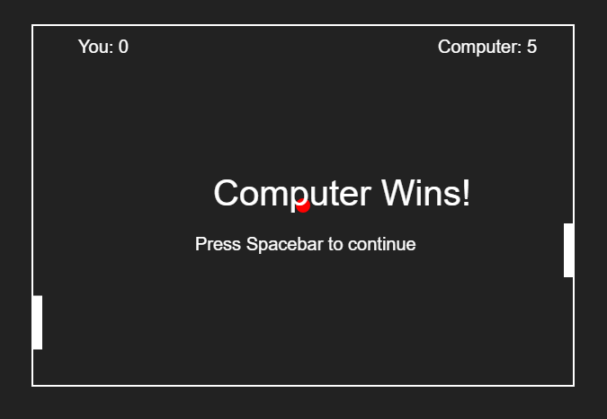

# Ping Pong Game

A simple Ping Pong game created using HTML, CSS, and JavaScript.

## Overview

This project implements a classic Ping Pong game where two players control paddles to bounce a ball back and forth. The game includes basic features such as paddle movement, ball bouncing, scoring, and a winner celebration animation.

## Documentation

For more detailed information on how the game works, please refer to the [Documentation PDF](documentation.pdf).

## How to Play

1. Open the `index.html` file in a web browser.
2. Use the mouse to control the left paddle.
3. Press the arrow keys (up and down) to control the right paddle.
4. The ball will move back and forth, bouncing off the paddles and walls.
5. The game continues until one player reaches a maximum score of 5.
6. When a player wins, a celebration animation will appear. Press the Spacebar to continue playing.

## File Structure

- `index.html`: The main HTML file containing the structure of the webpage.
- `pingpong.js`: The JavaScript file implementing the game logic.
- `style.css`: The CSS file for styling the game elements.

## Customization

Feel free to customize the game by adjusting variables in the `pingpong.js` file, such as paddle speed, ball speed, and maximum score.